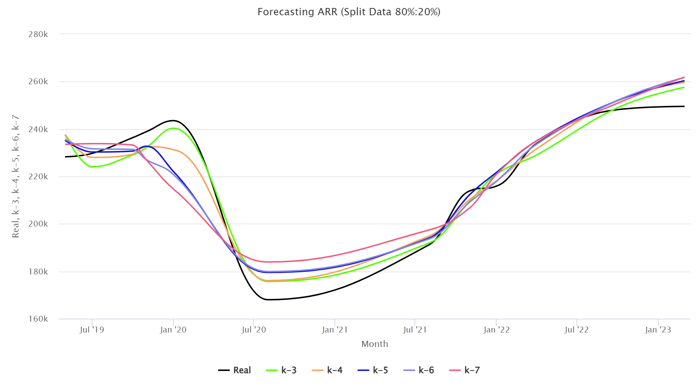

# Forecasting ARR using k-NN
Forecasting average room rate using k-nearest neighbor at Hotel S

# Introduction

The hospitality business is one of the highly competitive sectors, with thousands of hotels competing for attention from potential customers. In Indonesia, until 2022 as conditions began to improve with the decline of the Covid-19 pandemic outbreak, the global economy began to rise, including accommodation business began to carry out activities as before although not completely normal, there were 29,742 accomodation businesses or an increase of 7.73% from 2021. In the fierce hotel business competition to manage a hotel business, a lot of data and analysis are needed to make the right decisions. One important indicator in assessing the performance of a hotel is the Average Room Rate (ARR) which shows the average price of rooms sold by the hotel in a certain period. ARR is calculated from total room sales divided by total room nights occupied. From the ARR data obtained, it can make a picture of the future regarding expansion to increase the value of ARR in the future.
 
One of the main challenges in the hospitality business is the management of room prices related to price wars. Prices are sometimes non-standard (pricing cannibalism) thus damaging market demand, even after entering online marketing with OTA (Online Travel Agent) media. Price war is caused by the large stock of unused rooms. It was recorded that the occupancy rate of hotel rooms in Indonesia in July 2023 only reached 42.07% of the total rooms, more than 57.93% of which were not used. Price wars by offering lower room rates to attract customers can result in lower ARR, significant ARR fluctuations, and affect hotel revenue. In this context, ARR forecasting is critical for making smarter decisions related to pricing different room types and avoiding price wars. Based on this, this study will forecast the average room rate using k-nearest neighbor at Hotel S.

# Average Room Rate

Average room rate (ARR) is the average price of room sales obtained from the sale of the hotel room. Average room rate information is needed to determine the contribution of room revenue in covering the cost of the hotel. Since the price of a room in a hotel varies according to the type of room, then from the various prices can be obtained the average price. ARR shows how many rooms are sold by the hotel using the average calculation.
 

 
ARR gives an indication of single occupancy and discounting of rooms sold from the room shelf price, because this condition lowers ARR. ARR can be used to calculate lost room revenue, by multiplying the number of unsold rooms by the average rate. ARR can be compared to known break-even figures, to ascertain whether room division has resulted in profit on a given night.

# K-Nearest Neighbor

K-nearest neighbor (k-NN) is a classification technique that makes firm predictions on test data based on the comparison of K nearest neighbors. The nearest neighbor is the trained object that has the greatest similarity value or the smallest dissimilarity of the old data. The number of nearest neighbors is expressed by the value of k. The best k value depends on the data. In general, a high k value will reduce the effect of noise on classifications, but make the boundaries between each classification even more blurred.
 
The purpose of the k-NN algorithm is to classify new objects based on attributes and training samples. Where the results of the new test sample are classified based on the majority of categories in k-NN using the neighborliness classification as the predictive value of the new test data sample. The distance used is Eucliden Distance with the following formula.
 

# Analysis of k-Nearest Neighbor Algorithm Testing with Split Data 70%:30%

From forecasting carried out using k-NN at 70%:30% split data is known that the best RSME found in k-values is 3 with an RMSE of 6.335. The comparison of the simulation with k-values is 3 to 7 in the 70%:30% data split can be seen below.
 

# Analysis of k-Nearest Neighbor Algorithm Testing with Split Data 80%:20%

From forecasting carried out using k-NN at 80%:20% split data is known that the best RSME found in k-values is 3 with an RMSE of 5.915. The comparison of the simulation with k-values is 3 to 7 in the 80%:20% data split can be seen below.
 

